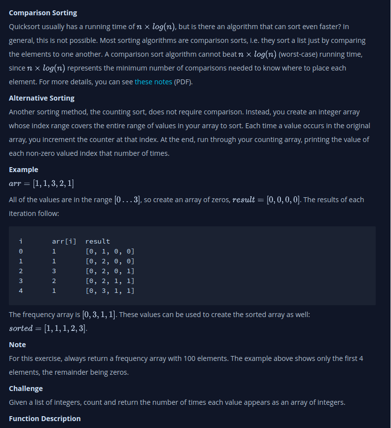

# Counting Sort 1
- Given a list of integers, count and return the number of times each value appears as an array of integers.

## My Thinking
1. Initialize a new result array with 100 elements, all set to 0.
2. Loop through the input array (arr).
3. For each element in arr, use its value as the index in the result array and increment the value at that index by 1.
4. Return the result array which now contains the frequency of each number in the input array.

