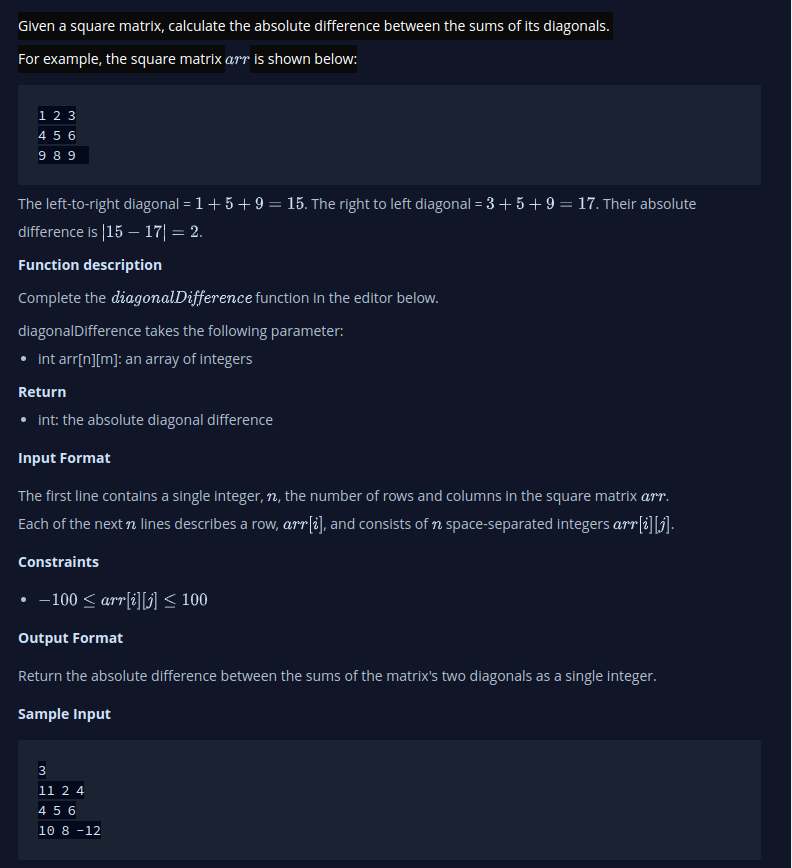

# Diagonal Difference
- Given a square matrix, calculate the absolute difference between the sums of its diagonals.

## My Thinking
1. Get the dimensions of the array get 
2. Get the diagonal from left to right by iterating from the first element of the first row to the last element of the last row,  incrementing the row and column index by 1 each time
3. Get the diagonal from right to left by iterate from the first element of the last column to the last element of the first column, incrementing the row index by 1 and decrementing the column index by 1 each time
4. Check to see the larger value between result from (2) and (3)
5. Subtract the smaller from the larger to always get a positive results

