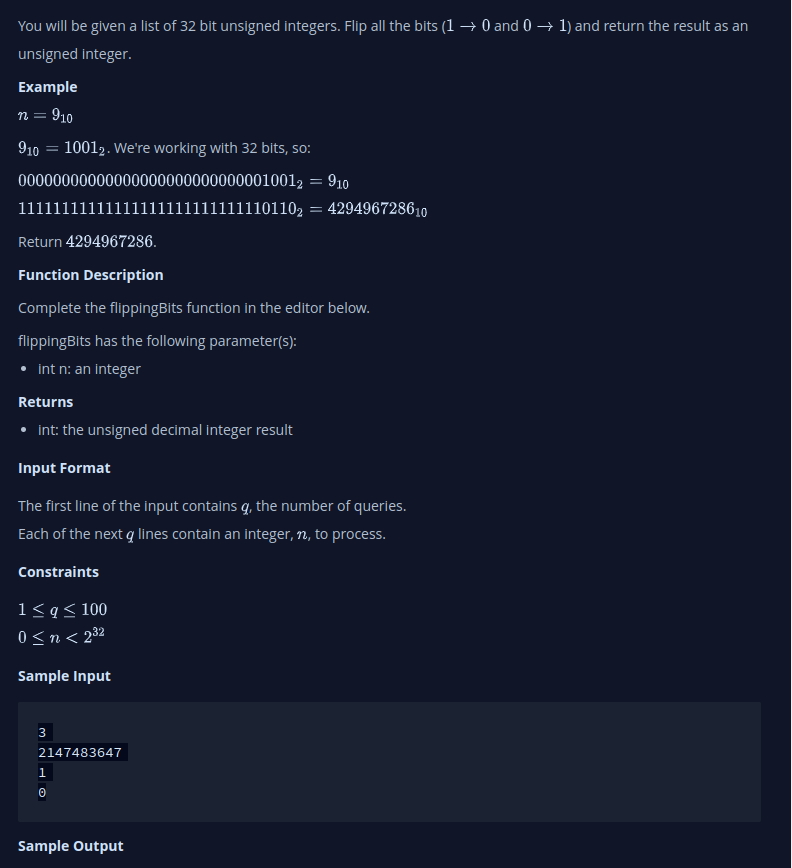

# Flipping Bits
- You will be given a list of 32 bit unsigned integers. Flip all the bits ( and ) and return the result as an unsigned integer.

## My Thinking
1. Apply Bitwise NOT Operator
2. Perform a bitwise AND operation (&) with the value 0xFFFFFFFF which is the maximum 32 bit
3. The result of step (2) is your final flipped number in base 10
