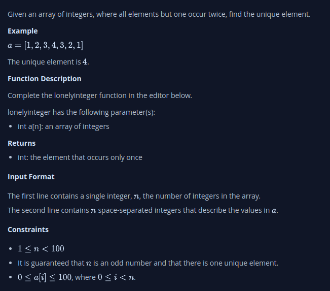

# Lonely Integer
- Given an array of integers, where all elements but one occur twice, find the unique element.

## My Thinking
1. Inititalize the map
2. Loop Through Array
3. Populate the map
    - Check if the element is already a key in the map
    - If it is not, add it to the map with a value of 1
    - If it is already in the map, increment the value associated with that key by 1
4. Find the unique element from the map
5. Return the element