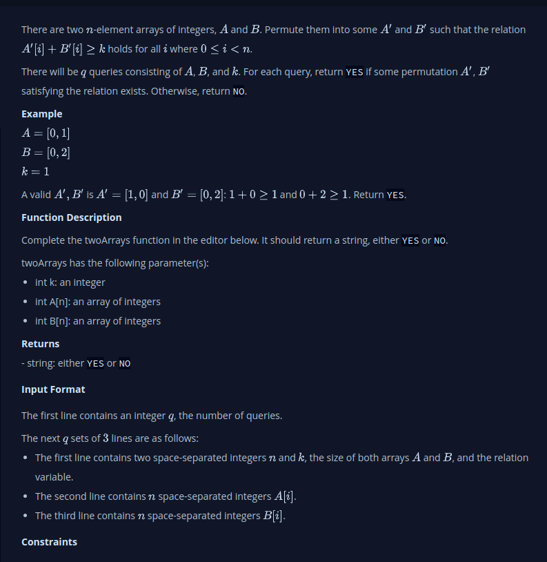

#  Permuting Two Arrays
- There are 2 n-element arrays of integers A and B. Permute A’ and B’  such that the relation A’[i] + B’[i] >= k holds for i all  where 0 <= i < n.

- There will be q  queries consisting of A’, B’, and k. For each query, return YES if some permutation A’, B’,  satisfying the relation exists. Otherwise, return NO.

## My Thinking
1. Loop through one of the list with i
2. On each element apply the condition to just see if the two arrays already satisfy this condition A’[i] + B’[i] >= k
3. If yes then return string ‘yes’
4. If not then 
    - Sort array A in ascending order.
    - Sort array B in descending order.
    - Check if pair A’[i] + B’[i] >= k
    - If all pairs satisfy the condition, return 'YES'.
    - If any pair does not satisfy the condition, return 'NO'.

