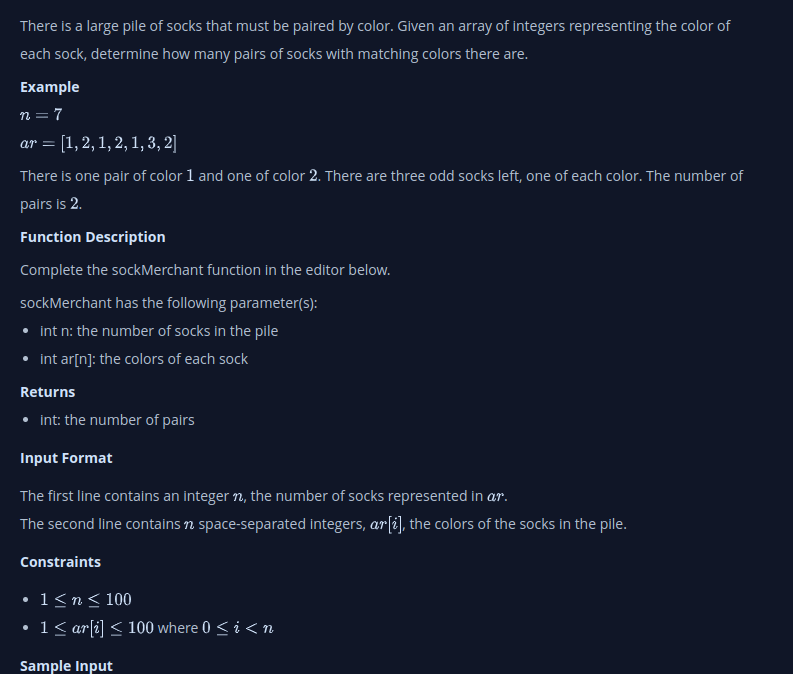

#  Saled by Match
There is a large pile of socks that must be paired by color. Given an array of integers representing the color of each sock, determine how many pairs of socks with matching colors there are.

Example
N = 7
Arr = [1, 2, 1, 2, 1, 3, 2]

There is one pair of color  and one of color . There are three odd socks left, one of each color. The number of pairs is .

## My Thinking
1. Set pairs to 0, to keep track of the total number of matching pairs found.
2. Create an empty map (or dictionary) named sockCounts to record the count of socks for each color.
3. Loop through the array, using i to index each sock.
4. For each sock ar[i], perform the following:
    - Check if ar[i] (the current color) exists in sockCounts.
        - If yes (a matching sock has been seen before):
            - Increment pairs by 1 (a pair has been found).
            - Decrement the count of ar[i] in sockCounts by 1. If the count reaches 0, remove ar[i] from sockCounts.
        - Sort array B in descending order.
    - If no (the sock color hasn't been encountered before):
        - Add ar[i] to sockCounts with a count of 1

