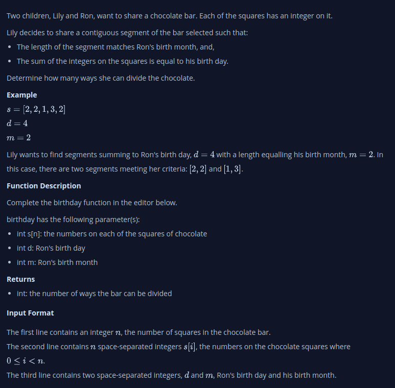

#  Subarray Division 1
Two children, Lily and Ron, want to share a chocolate bar. Each of the squares has an integer on it. Lily decides to share a contiguous segment of the bar selected such that:

- The length of the segment matches Ron's birth month, and,
- The sum of the integers on the squares is equal to his birthday.
- Determine how many ways she can divide the chocolate.

Example
s = [2, 2, 1, 3, 2] 
d = 4
m = 2

Lily wants to find segments summing to Ron's birthday, d = 4  with a length equalling his birth month, m = 2. In this case, there are two segments meeting her criteria: [2, 2] and [1, 3].

## What I’m thinking…
1. Initialize a counter to 0.
2. Loop through the array, but only up to n - m + 1, because segments beyond this point would not have m elements.
3. In each iteration of the loop, sum up m elements starting from the current index i.
4. If this sum is equal to d, increment the counter.
5. After the loop finishes, return the counter.

